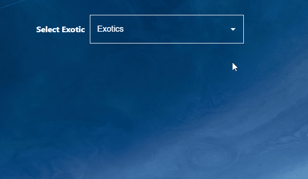

# D2loadouts.com

D2loadout is a Destiny 2 application that allows players to seamlessly create, optimize, equip, save, and share their builds. The goal of D2loadout is to remove the hassle of using multiple tools to achieve their build goals or to use their favorite streamers' loadouts. The table of contents includes a section for users and a section for developers. The user section covers all the features and what you can do with D2loadout. Join our Discord for requesting features and more updates!

# Reporting Bugs

Search the existing issues and closed issues. If the bug doesn't exist, report the bug and show us how to replicate it if possible.

## Table of Contents: User Section

- [Character Selection](#character-selection)
- [Find Optimal Armor Combination](#find-optimal-armor-combination)
- [Select Exotic](#select-exotic)
- [Exotic Class Item Search](#exotic-class-item-search)
- [Subclass Modification](#subclass-modification)
- [Select Optimal Build](#select-optimal-build)
- [Equip Armor Mods](#equip-armor-mods)
- [Equip Loadout](#equip-loadout)
- [Save in Game](#save-in-game)
- [Share Loadout](#share-loadout)
- [How to Use Loadout Link](#how-to-use-loadout-link)

## Table of Contents: Developer Section

- [License](#license)

## Character Selection

  
Click to expand Character Selection

This is how you can select a character in D2loadout.

## Find Optimal Armor Combination

  
Click to expand Find Optimal Armor Combination

Use the optimal armor combination feature to find the best gear for your build.

## Select Exotic

  
Click to expand Select Exotic

Select the desired exotic to fit your build.

## Exotic Class Item Search

  
Click to expand Exotic Class Item Search

Search for exotic class items efficiently.

## Subclass Modification

  
Click to expand Subclass Modification

Customize your subclass abilities.

## Select Optimal Build

  
Click to expand Select Optimal Build

Find the optimal build using your selected armor, weapons, and mods.

## Equip Armor Mods

  
Click to expand Equip Armor Mods

Easily equip armor mods to boost your stats.

## Equip Loadout

  
Click to expand Equip Loadout

Equip your loadout with just a few clicks.

## Save in Game

  
Click to expand Save in Game

Save your loadout in-game and use it later.

## Share Loadout

  
Click to expand Share Loadout

Easily share your loadout with your friends.

## How to Use Loadout Link

  
Click to expand How to Use Loadout Link

Learn how to use and share your loadout link.

